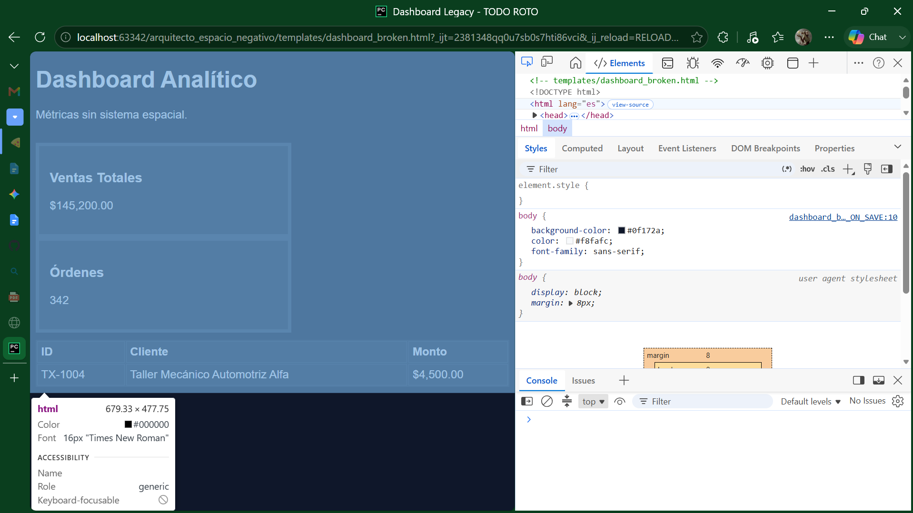
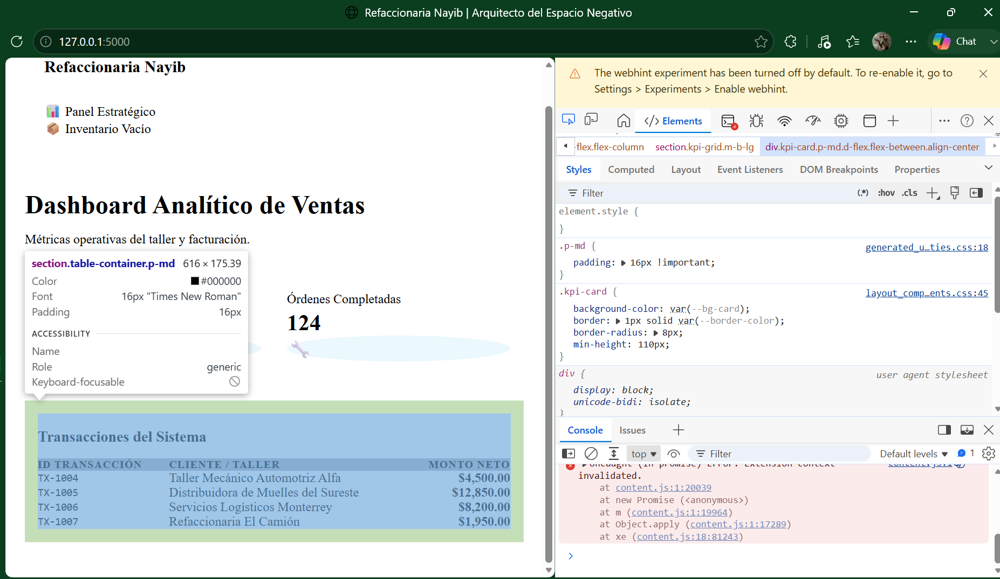

# Informe de Diagnóstico Técnico: Dashboard Analítico (Legacy)
**Especialista:** Nayib  
**Certificación:** Desarrollo de Software con Python SSR  

### 1. Auditoría del Modelo de Caja (Box Model)
La inspección exhaustiva realizada mediante las Herramientas de Desarrollador (DevTools) del navegador reveló que el ecosistema heredado (`styles_legacy.css`) carece de una directiva de reseteo global. Esto obliga al motor de renderizado a computar los elementos bajo la propiedad nativa `box-sizing: content-box`. 

Como consecuencia directa, cuando se añade un `padding` interno o un `border` a las tarjetas de KPI o a las celdas de las tablas, estos valores se *suman* de forma aditiva al ancho total asignado (`width`). Esto genera un fenómeno de desbordamiento crítico (`overflow-x`), provocando que los contenedores colapsen, se rompa la simetría de la cuadrícula y aparezca una barra de scroll horizontal indeseada en pantallas móviles, arruinando la experiencia responsiva.

### 2. Patología del Colapso de Márgenes (Margin Collapse)
Se detectó una asfixia visual severa entre el encabezado principal (`header`) y la grilla de métricas. Al inspeccionar con DevTools, se confirmó el fenómeno físico de **Colapso de Márgenes Verticales**. 

Tanto el elemento de encabezado como la sección de tarjetas operan como elementos a nivel de bloque (*block-level elements*). El navegador, siguiendo sus reglas de renderizado histórico, fusiona el `margin-bottom` del encabezado con el `margin-top` de la sección, aplicando un único espacio equivalente al valor del margen más grande entre ambos, en lugar de sumarlos. Al no existir un Contexto de Formato de Bloque (BFC) configurado ni elementos de contención protectores (como paddings o bordes en el contenedor padre), el ritmo vertical colapsa y los componentes se aglutinan visualmente.

### 3. Mapa de Inconsistencia Sistémica y Alineación
El análisis métrico espacial arrojó una total ausencia de armonía visual: se evidenciaron espaciados arbitrarios de 10px, 15px y 12px distribuidos al azar. Esto infringe flagrantemente la **Ley de Proximidad de la Gestalt**, ya que el cerebro del usuario no logra descifrar qué elementos están relacionados operativamente debido al desorden dimensional. 

Adicionalmente, en la tabla analítica, los montos financieros y los identificadores de texto se alineaban uniformemente a la izquierda, lo que destruye la línea imaginaria de lectura vertical (`baseline alignment`), dificultando al operador del backend comparar magnitudes numéricas con rapidez.

## Evidencia Visual y Comparativa de DevTools

### Evidencia 1: "Antes" - Colapso del Box Model y Asfixia Visual (Legacy)
Representación del comportamiento `content-box` donde los rellenos alteran las dimensiones reales del componente, sumado al colapso de márgenes contiguos.

### Evidencia 2: "Después" - Reconstrucción Armónica y Rejilla Sistémica (Fixed)
Visualización de la macroestructura controlada mediante CSS Grid. El espacio libre se gestiona mediante `gap` y el reset universal absorbe los paddings internamente (`border-box`).

